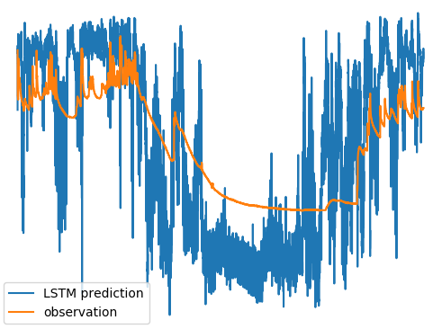

# lstm-land-surface
### This repository is an attempt to train an LSTM to predict land surface fluxes.
### The first thing I am trying to do is predict soil moisture from atmospheric forcings.
### This project was abandoned once NeuralHydrology started predicting land surface fluxes. See
[NeuralHydrology](https://github.com/neuralhydrology/neuralhydrology) for a legit Deep Learning land surface model.

